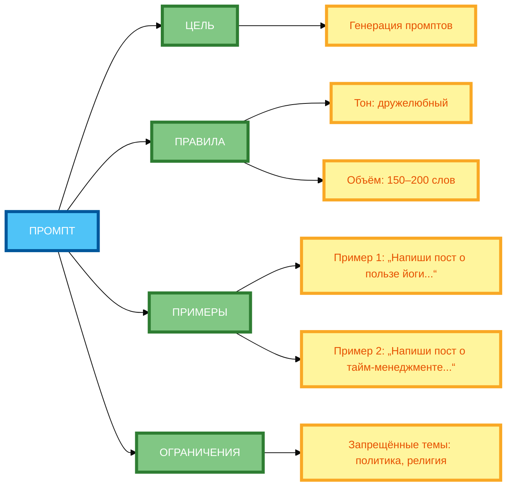

# Метапромпты: учим нейросеть понимать правила

В предыдущей статье вы узнали, как организовать «Дебаты» между двумя позициями для глубокого анализа темы. Но даже если вы организовали дебаты, **каждый промпт всё равно требует ручной настройки**. В этой статье вы научитесь использовать **метапромпты** — технику, которая позволяет **учит нейросеть понимать правила** и **генерировать другие промпты** автоматически.

## Что такое метапромпт: промпт для создания других промптов

**Метапромпт** — это промпт, который **создаёт другие промпты**. Вместо того чтобы писать промпт вручную, вы **описываете правила** и просите нейросеть **сгенерировать промпт** по этим правилам.

**Суть метода:**

- **Метапромпт** — это «промпт для промптов».
- **Правила** — это инструкции, по которым должен создаваться промпт.
- **Примеры** — это образцы готовых промптов.
- **Результат** — это готовый промпт, созданный по правилам.

**Пример без метапромпта:**

```
Напиши промпт для генерации постов о пользе йоги.
```

**Результат:** Один промпт, который может быть неполным или не соответствовать вашим требованиям.

**Пример с метапромптом:**

```
Создай метапромпт для генерации промптов по теме «Написание постов для соцсетей».

Правила:
1. Тон: дружелюбный, мотивирующий.
2. Объём: 150–200 слов.
3. Структура: 3 абзаца + призыв к действию.
4. Ограничения: без эмодзи, без слов «должна», «обязательно».

Пример 1: «Напиши пост о пользе йоги. Целевая аудитория: женщины 30–40 лет. Тон: дружелюбный. Объём: 150–200 слов.»

Пример 2: «Напиши пост о тайм-менеджменте. Целевая аудитория: офисные работники. Тон: мотивирующий. Объём: 150–200 слов.»

Ограничения: запрещённые темы — политика, религия.

Формат вывода: готовый промпт без комментариев.

Критерии оценки: промпт должен быть конкретным, структурированным и соответствовать правилам.
```

**Результат:** Готовый метапромпт, который можно использовать для генерации других промптов.

## Структура метапромпта: описание задачи, правила генерации, примеры

**Структура метапромпта:**

1. **Цель** — для чего создаётся промпт.
2. **Правила генерации** — основные требования к промпту.
3. **Примеры** — 2–3 готовых промпта для образца.
4. **Ограничения** — что нельзя включать.
5. **Формат вывода** — как должен выглядеть результат.
6. **Критерии оценки** — как проверить качество промпта.

**Пример структуры:**

```
Цель: Создать метапромпт для генерации промптов по теме «Написание постов для соцсетей».

Правила генерации:
1. Тон: дружелюбный, мотивирующий.
2. Объём: 150–200 слов.
3. Структура: 3 абзаца + призыв к действию.

Примеры:
Пример 1: «Напиши пост о пользе йоги. Целевая аудитория: женщины 30–40 лет. Тон: дружелюбный. Объём: 150–200 слов.»
Пример 2: «Напиши пост о тайм-менеджменте. Целевая аудитория: офисные работники. Тон: мотивирующий. Объём: 150–200 слов.»

Ограничения: запрещённые темы — политика, религия.

Формат вывода: готовый промпт без комментариев.

Критерии оценки: промпт должен быть конкретным, структурированным и соответствовать правилам.
```

## Когда применять: стандартизация промптов, обучение команды, автоматизация

**1. Стандартизация промптов**

Когда нужно **стандартизировать** промпты для всей команды или компании.

**Пример:**

- Создать метапромпт для генерации промптов по определённой теме.
- Все сотрудники используют один метапромпт.
- Результаты получаются **единообразными**.

**2. Обучение команды**

Когда нужно **обучить команду** создавать качественные промпты.

**Пример:**

- Создать метапромпт для генерации промптов.
- Команда изучает правила и примеры.
- Результат: команда **самостоятельно** создаёт качественные промпты.

**3. Автоматизация**

Когда нужно **автоматизировать** создание промптов.

**Пример:**

- Создать метапромпт для генерации промптов.
- Автоматически генерировать промпты для разных задач.
- Результат: **экономия времени** и **повторяемость**.

## Примеры метапромптов для разных областей (маркетинг, образование, аналитика)

**Пример 1: Маркетинг (полный рабочий промпт)**

```
Создай метапромпт для генерации промптов по теме «Написание постов для соцсетей».

Цель: Создать метапромпт для генерации промптов по теме «Написание постов для соцсетей».

Правила генерации:
1. Тон: дружелюбный, мотивирующий.
2. Объём: 150–200 слов.
3. Структура: 3 абзаца + призыв к действию.

Примеры:
Пример 1: «Напиши пост о пользе йоги. Целевая аудитория: женщины 30–40 лет. Тон: дружелюбный. Объём: 150–200 слов.»
Пример 2: «Напиши пост о тайм-менеджменте. Целевая аудитория: офисные работники. Тон: мотивирующий. Объём: 150–200 слов.»

Ограничения: запрещённые темы — политика, религия.

Формат вывода: готовый промпт без комментариев.

Критерии оценки: промпт должен быть конкретным, структурированным и соответствовать правилам.
```

**Пример 2: Образование (полный рабочий промпт)**

```
Создай метапромпт для генерации промптов по теме «Создание уроков для онлайн-курса».

Цель: Создать метапромпт для генерации промптов по теме «Создание уроков для онлайн-курса».

Правила генерации:
1. Структура: введение, 3–5 блоков, вывод.
2. Объём: 500–700 слов.
3. Тон: дружелюбный, мотивирующий.
4. Примеры: 2–3 примера на каждую тему.

Примеры:
Пример 1: «Создай урок о тайм-менеджменте. Аудитория: студенты. Структура: введение, 3 блока, вывод. Объём: 500–700 слов.»
Пример 2: «Создай урок о публичных выступлениях. Аудитория: менеджеры. Структура: введение, 4 блока, вывод. Объём: 500–700 слов.»

Ограничения: запрещённые темы — политика, религия.

Формат вывода: готовый промпт без комментариев.

Критерии оценки: промпт должен быть структурированным, содержать примеры и соответствовать правилам.
```

**Пример 3: Аналитика (полный рабочий промпт)**

```
Создай метапромпт для генерации промптов по теме «Анализ данных о продажах».

Цель: Создать метапромпт для генерации промптов по теме «Анализ данных о продажах».

Правила генерации:
1. Структура: описание данных, анализ, выводы, рекомендации.
2. Объём: 300–500 слов.
3. Тон: нейтральный, объективный.
4. Требования: использовать данные из таблицы.

Примеры:
Пример 1: «Проанализируй данные о продажах за 3 месяца. Данные: таблица с колонками „Месяц“, „Выручка“, „Затраты“, „Прибыль“. Структура: описание данных, анализ, выводы, рекомендации. Объём: 300–500 слов.»
Пример 2: «Проанализируй данные о конверсии лендинга. Данные: таблица с колонками „Вариант“, „Просмотры“, „Клики“, „Конверсия“. Структура: описание данных, анализ, выводы, рекомендации. Объём: 300–500 слов.»

Ограничения: не придумывай данные, которых нет в таблице.

Формат вывода: готовый промпт без комментариев.

Критерии оценки: промпт должен быть структурированным, использовать данные из таблицы и соответствовать правилам.
```

## Типичные ошибки: избыточная абстрактность, отсутствие примеров

**Ошибка 1: Избыточная абстрактность**

**Некорректно:**

```
Создай метапромпт для генерации промптов.
```

**Почему не работает:** Слишком абстрактно. Нейросеть не понимает, какие промпты нужно генерировать.

**Корректно:**

```
Создай метапромпт для генерации промптов по теме «Написание постов для соцсетей».
```

**Ошибка 2: Отсутствие примеров**

**Некорректно:**

```
Создай метапромпт для генерации промптов по теме «Написание постов для соцсетей».

Правила:
1. Тон: дружелюбный.
2. Объём: 150–200 слов.
```

**Почему не работает:** Нет примеров. Нейросеть не понимает, как должен выглядеть готовый промпт.

**Корректно:**

```
Создай метапромпт для генерации промптов по теме «Написание постов для соцсетей».

Правила:
1. Тон: дружелюбный.
2. Объём: 150–200 слов.

Примеры:
Пример 1: «Напиши пост о пользе йоги. Целевая аудитория: женщины 30–40 лет. Тон: дружелюбный. Объём: 150–200 слов.»
```

**Ошибка 3: Отсутствие ограничений**

**Некорректно:**

```
Создай метапромпт для генерации промптов по теме «Написание постов для соцсетей».

Правила:
1. Тон: дружелюбный.
2. Объём: 150–200 слов.
```

**Почему не работает:** Нет ограничений. Нейросеть может генерировать промпты на запрещённые темы.

**Корректно:**

```
Создай метапромпт для генерации промптов по теме «Написание постов для соцсетей».

Правила:
1. Тон: дружелюбный.
2. Объём: 150–200 слов.

Ограничения: запрещённые темы — политика, религия.
```

## Комбинирование с другими техниками (роли, цепочки)

**Комбинирование 1: Метапромпт + Роли**

```
Ты — эксперт по созданию метапромптов. Создай метапромпт для генерации промптов по теме «Написание постов для соцсетей».

Цель: Создать метапромпт для генерации промптов по теме «Написание постов для соцсетей».

Правила генерации:
1. Тон: дружелюбный, мотивирующий.
2. Объём: 150–200 слов.
3. Структура: 3 абзаца + призыв к действию.

Примеры:
Пример 1: «Напиши пост о пользе йоги. Целевая аудитория: женщины 30–40 лет. Тон: дружелюбный. Объём: 150–200 слов.»
Пример 2: «Напиши пост о тайм-менеджменте. Целевая аудитория: офисные работники. Тон: мотивирующий. Объём: 150–200 слов.»

Ограничения: запрещённые темы — политика, религия.

Формат вывода: готовый промпт без комментариев.

Критерии оценки: промпт должен быть конкретным, структурированным и соответствовать правилам.
```

**Комбинирование 2: Метапромпт + Цепочка промптов**

```
Шаг 1: Создай метапромпт для генерации промптов по теме «Написание постов для соцсетей».

Цель: Создать метапромпт для генерации промптов по теме «Написание постов для соцсетей».

Правила генерации:
1. Тон: дружелюбный, мотивирующий.
2. Объём: 150–200 слов.
3. Структура: 3 абзаца + призыв к действию.

Примеры:
Пример 1: «Напиши пост о пользе йоги. Целевая аудитория: женщины 30–40 лет. Тон: дружелюбный. Объём: 150–200 слов.»
Пример 2: «Напиши пост о тайм-менеджменте. Целевая аудитория: офисные работники. Тон: мотивирующий. Объём: 150–200 слов.»

Ограничения: запрещённые темы — политика, религия.

Формат вывода: готовый промпт без комментариев.

Критерии оценки: промпт должен быть конкретным, структурированным и соответствовать правилами.

Шаг 2: Используй созданный метапромпт для генерации 3 промптов по теме «Написание постов о тайм-менеджменте».
```

## Практические рекомендации по созданию эффективных метапромптов

**Рекомендация 1: Чётко определи цель**

**Некорректно:** «Создай метапромпт.»

**Корректно:** «Создай метапромпт для генерации промптов по теме „Написание постов для соцсетей“.»

**Рекомендация 2: Определи правила генерации**

**Некорректно:** «Создай метапромпт.»

**Корректно:** «Правила генерации: 1) Тон: дружелюбный. 2) Объём: 150–200 слов. 3) Структура: 3 абзаца + призыв к действию.»

**Рекомендация 3: Добавь примеры (2–3 готовых промпта)**

**Некорректно:** «Создай метапромпт.»

**Корректно:** «Примеры: Пример 1: „Напиши пост о пользе йоги. Целевая аудитория: женщины 30–40 лет. Тон: дружелюбный. Объём: 150–200 слов.“»

**Рекомендация 4: Укажи ограничения**

**Некорректно:** «Создай метапромпт.»

**Корректно:** «Ограничения: запрещённые темы — политика, религия.»

**Рекомендация 5: Определи формат вывода**

**Некорректно:** «Создай метапромпт.»

**Корректно:** «Формат вывода: готовый промпт без комментариев.»

**Рекомендация 6: Определи критерии оценки**

**Некорректно:** «Создай метапромпт.»

**Корректно:** «Критерии оценки: промпт должен быть конкретным, структурированным и соответствовать правилам.»

## Схема 1: «Структура метапромпта» (mind map)



**Рисунок 1.** «Структура метапромпта» (mind map). **3 ряда**: Промпт слева, 4 компонента в среднем ряду (ЦЕЛЬ, ПРАВИЛА, ПРИМЕРЫ, ОГРАНИЧЕНИЯ), детали справа. Компактная 1:1, текст полный, цвета и рамки 4px. Расширение слева направо, не длинная по горизонтали.

## Схема 2: «Процесс создания метапромпта» (flowchart)


**Рисунок 2.** «Процесс создания метапромпта» (flowchart). **3 ряда**: Промпт слева, 4 этапа в среднем ряду (АНАЛИЗ ЗАДАЧИ → ФОРМУЛИРОВКА ПРАВИЛ → ДОБАВЛЕНИЕ ПРИМЕРОВ → ТЕСТИРОВАНИЕ), Результат справа. Компактная 1:1, текст полный, цвета и рамки 4px. Расширение слева направо, не длинная по горизонтали.

## Таблица: «6 компонентов метапромпта»

| Компонент | Описание | Пример |
|-----------|----------|--------|
| **Цель** | Для чего создаётся промпт | «Создать метапромпт для генерации промптов по теме „Написание постов для соцсетей“.» |
| **Правила генерации** | Основные требования к промпту | «Правила: 1) Тон: дружелюбный. 2) Объём: 150–200 слов. 3) Структура: 3 абзаца + призыв к действию.» |
| **Примеры** | 2–3 готовых промпта для образца | «Пример 1: „Напиши пост о пользе йоги. Целевая аудитория: женщины 30–40 лет. Тон: дружелюбный. Объём: 150–200 слов.“» |
| **Ограничения** | Что нельзя включать | «Ограничения: запрещённые темы — политика, религия.» |
| **Формат вывода** | Как должен выглядеть результат | «Формат вывода: готовый промпт без комментариев.» |
| **Критерии оценки** | Как проверить качество промпта | «Критерии оценки: промпт должен быть конкретным, структурированным и соответствовать правилам.» |

**Рисунок 3.** «6 компонентов метапромпта». Таблица содержит 6 компонентов с описанием и примером.

## Практическое задание

**Задание:** Создайте метапромпт для генерации промптов по теме «Написание постов для соцсетей».

**Требования:**

- Правила: тон (дружелюбный, мотивирующий), объём (150–200 слов), структура (3 абзаца + призыв к действию).
- 2 примера промптов.
- Ограничения: запрещённые темы (политика, религия).

**Чек-лист для самопроверки:**

- [ ] Цель: для чего создаётся промпт
- [ ] Правила генерации: основные требования к промпту
- [ ] Примеры: 2–3 готовых промпта для образца
- [ ] Ограничения: что нельзя включать
- [ ] Формат вывода: как должен выглядеть результат
- [ ] Критерии оценки: как проверить качество промпта
- [ ] Промпт содержит конкретные инструкции

## Заключение

Метапромпты — это мощный инструмент для стандартизации и автоматизации создания промптов. Главное — чётко определять цель, правила, примеры, ограничения, формат вывода и критерии оценки. В следующей статье вы узнаете, как использовать мастерпромпты для создания универсальных шаблонов.