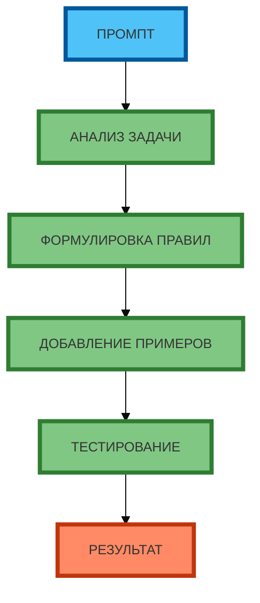

# Схема 2: «Процесс создания метапромпта» (flowchart, линейная, сверху вниз)

**Рисунок 2.** «Процесс создания метапромпта» (flowchart). **Линейная зависимость** (сверху вниз): ПРОМПТ → АНАЛИЗ ЗАДАЧИ → ФОРМУЛИРОВКА ПРАВИЛ → ДОБАВЛЕНИЕ ПРИМЕРОВ → ТЕСТИРОВАНИЕ → РЕЗУЛЬТАТ. Компактная 1:1, текст полный, цвета и рамки 4px. Прямые стрелки.