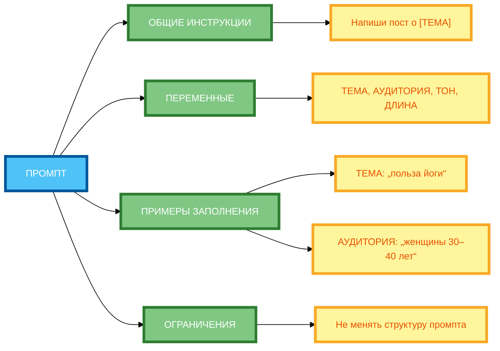

# Мастерпромпты: универсальные шаблоны для широкого круга задач

В предыдущей статье вы узнали, как использовать метапромпты для создания других промптов. Но даже если вы создали метапромпт, **он всё равно предназначен для одной конкретной темы**. В этой статье вы научитесь использовать **мастерпромпты** — универсальные шаблоны, которые можно **адаптировать под разные задачи** в рамках одного класса проблем.

## Что такое мастерпромпт: определение и назначение (шаблон для решения целого класса задач)

**Мастерпромпт** — это **универсальный шаблон промпта**, который можно использовать для решения **целого класса задач**. Вместо того чтобы создавать отдельный промпт для каждой задачи, вы создаёте **один шаблон** и **адаптируете** его под конкретную задачу.

**Суть метода:**

- **Мастерпромпт** — это «шаблон промпта».
- **Переменные** — это параметры, которые можно менять.
- **Заполнители** — это места, куда вставляются значения переменных.
- **Инструкции по адаптации** — это правила, как заполнять переменные.

**Пример без мастерпромпта:**

```
Напиши пост о пользе йоги. Целевая аудитория: женщины 30–40 лет. Тон: дружелюбный. Объём: 150–200 слов.
```

**Результат:** Один промпт, который подходит только для этой конкретной задачи.

**Пример с мастерпромптом:**

```
Напиши пост о [ТЕМА]. Целевая аудитория: [АУДИТОРИЯ]. Тон: [ТОН]. Объём: [ДЛИНА] слов.

Переменные:
- ТЕМА: тема поста
- АУДИТОРИЯ: целевая аудитория
- ТОН: дружелюбный/мотивирующий/юмористический
- ДЛИНА: короткий (100–150 слов)/средний (150–200 слов)/длинный (200–300 слов)
```

**Результат:** Универсальный шаблон, который можно адаптировать под любую тему, аудиторию, тон и длину.

## Отличия от обычного промпта: универсальность, параметризация, масштабируемость

**1. Универсальность**

- **Обычный промпт:** подходит только для одной конкретной задачи.
- **Мастерпромпт:** подходит для **целого класса задач**.

**Пример:**

- **Обычный промпт:** «Напиши пост о пользе йоги для женщин 30–40 лет.»
- **Мастерпромпт:** «Напиши пост о [ТЕМА]. Целевая аудитория: [АУДИТОРИЯ].»

**2. Параметризация**

- **Обычный промпт:** все значения жёстко заданы.
- **Мастерпромпт:** значения **параметризованы** (можно менять).

**Пример:**

- **Обычный промпт:** «Напиши пост о пользе йоги. Целевая аудитория: женщины 30–40 лет.»
- **Мастерпромпт:** «Напиши пост о [ТЕМА]. Целевая аудитория: [АУДИТОРИЯ].»

**3. Масштабируемость**

- **Обычный промпт:** нужно создавать новый промпт для каждой задачи.
- **Мастерпромпт:** один шаблон можно использовать **многократно**.

**Пример:**

- **Обычный промпт:** нужно создать 10 разных промптов для 10 тем.
- **Мастерпромпт:** один мастерпромпт можно адаптировать под 10 тем за 10 минут.

## Структура мастерпромпта: переменные, заполнители, инструкции по адаптации

**Структура мастерпромпта:**

1. **Общие инструкции** — правила, которые не меняются.
2. **Переменные** — параметры, которые можно менять.
3. **Заполнители** — места, куда вставляются значения переменных.
4. **Примеры заполнения** — образцы, как заполнять переменные.
5. **Ограничения** — что нельзя менять.
6. **Инструкции по адаптации** — как адаптировать мастерпромпт под конкретную задачу.

**Пример структуры:**

```
Напиши пост о [ТЕМА]. Целевая аудитория: [АУДИТОРИЯ]. Тон: [ТОН]. Объём: [ДЛИНА] слов.

Переменные:
- ТЕМА: тема поста
- АУДИТОРИЯ: целевая аудитория
- ТОН: дружелюбный/мотивирующий/юмористический
- ДЛИНА: короткий (100–150 слов)/средний (150–200 слов)/длинный (200–300 слов)

Примеры заполнения:
- ТЕМА: «польза йоги»
- АУДИТОРИЯ: «женщины 30–40 лет»
- ТОН: «дружелюбный»
- ДЛИНА: «средний (150–200 слов)»

Ограничения: не менять структуру промпта.

Инструкции по адаптации: замени переменные на конкретные значения для вашей задачи.
```

## Примеры мастерпромптов для разных областей (маркетинг, образование, аналитика)

**Пример 1: Маркетинг (полный рабочий промпт)**

```
Напиши пост о [ТЕМА]. Целевая аудитория: [АУДИТОРИЯ]. Тон: [ТОН]. Объём: [ДЛИНА] слов. Ключевые сообщения: [КЛЮЧЕВЫЕ СООБЩЕНИЯ].

Переменные:
- ТЕМА: тема поста
- АУДИТОРИЯ: целевая аудитория
- ТОН: дружелюбный/мотивирующий/юмористический
- ДЛИНА: короткий (100–150 слов)/средний (150–200 слов)/длинный (200–300 слов)
- КЛЮЧЕВЫЕ СООБЩЕНИЯ: 3 ключевых сообщения (через запятую)

Примеры заполнения:
- ТЕМА: «польза йоги»
- АУДИТОРИЯ: «женщины 30–40 лет»
- ТОН: «дружелюбный»
- ДЛИНА: «средний (150–200 слов)»
- КЛЮЧЕВЫЕ СООБЩЕНИЯ: «15 минут в день, для начинающих, бесплатный вебинар»

Ограничения: не менять структуру промпта.

Инструкции по адаптации: замени переменные на конкретные значения для вашей задачи.
```

**Пример 2: Образование (полный рабочий промпт)**

```
Создай урок о [ТЕМА]. Аудитория: [АУДИТОРИЯ]. Структура: [СТРУКТУРА]. Объём: [ДЛИНА] слов. Примеры: [ПРИМЕРЫ].

Переменные:
- ТЕМА: тема урока
- АУДИТОРИЯ: целевая аудитория
- СТРУКТУРА: введение, 3–5 блоков, вывод
- ДЛИНА: короткий (300–500 слов)/средний (500–700 слов)/длинный (700–1000 слов)
- ПРИМЕРЫ: 2–3 примера на каждую тему

Примеры заполнения:
- ТЕМА: «тайм-менеджмент»
- АУДИТОРИЯ: «студенты»
- СТРУКТУРА: «введение, 3 блока, вывод»
- ДЛИНА: «средний (500–700 слов)»
- ПРИМЕРЫ: «2–3 примера на каждую тему»

Ограничения: не менять структуру промпта.

Инструкции по адаптации: замени переменные на конкретные значения для вашей задачи.
```

**Пример 3: Аналитика (полный рабочий промпт)**

```
Проанализируй данные о [ТЕМА]. Данные: [ДАННЫЕ]. Структура: [СТРУКТУРА]. Объём: [ДЛИНА] слов. Выводы: [ВЫВОДЫ].

Переменные:
- ТЕМА: тема анализа
- ДАННЫЕ: описание данных
- СТРУКТУРА: описание данных, анализ, выводы, рекомендации
- ДЛИНА: короткий (200–300 слов)/средний (300–500 слов)/длинный (500–700 слов)
- ВЫВОДЫ: 2–3 вывода

Примеры заполнения:
- ТЕМА: «продажи за 3 месяца»
- ДАННЫЕ: «таблица с колонками „Месяц“, „Выручка“, „Затраты“, „Прибыль“»
- СТРУКТУРА: «описание данных, анализ, выводы, рекомендации»
- ДЛИНА: «средний (300–500 слов)»
- ВЫВОДЫ: «2–3 вывода»

Ограничения: не менять структуру промпта.

Инструкции по адаптации: замени переменные на конкретные значения для вашей задачи.
```

## Как адаптировать мастерпромпт под конкретную задачу (замена переменных, добавление контекста)

**1. Замена переменных**

**Пример:**

```
Мастерпромпт: «Напиши пост о [ТЕМА]. Целевая аудитория: [АУДИТОРИЯ]. Тон: [ТОН]. Объём: [ДЛИНА] слов.»

Адаптация:
- ТЕМА: «польза йоги»
- АУДИТОРИЯ: «женщины 30–40 лет»
- ТОН: «дружелюбный»
- ДЛИНА: «средний (150–200 слов)»

Результат: «Напиши пост о пользе йоги. Целевая аудитория: женщины 30–40 лет. Тон: дружелюбный. Объём: 150–200 слов.»
```

**2. Добавление контекста**

**Пример:**

```
Мастерпромпт: «Напиши пост о [ТЕМА]. Целевая аудитория: [АУДИТОРИЯ]. Тон: [ТОН]. Объём: [ДЛИНА] слов.»

Адаптация с контекстом:
- ТЕМА: «польза йоги»
- АУДИТОРИЯ: «женщины 30–40 лет, офисные работницы, матери»
- ТОН: «дружелюбный»
- ДЛИНА: «средний (150–200 слов)»
- Контекст: «У них мало времени на себя, они устали, скептичны к „очередной йоге“.»

Результат: «Напиши пост о пользе йоги. Целевая аудитория: женщины 30–40 лет, офисные работницы, матери. У них мало времени на себя, они устали, скептичны к „очередной йоге“. Тон: дружелюбный. Объём: 150–200 слов.»
```

**3. Добавление ограничений**

**Пример:**

```
Мастерпромпт: «Напиши пост о [ТЕМА]. Целевая аудитория: [АУДИТОРИЯ]. Тон: [ТОН]. Объём: [ДЛИНА] слов.»

Адаптация с ограничениями:
- ТЕМА: «польза йоги»
- АУДИТОРИЯ: «женщины 30–40 лет»
- ТОН: «дружелюбный»
- ДЛИНА: «средний (150–200 слов)»
- Ограничения: «без эмодзи, без слов „должна“, „обязательно“»

Результат: «Напиши пост о пользе йоги. Целевая аудитория: женщины 30–40 лет. Тон: дружелюбный. Объём: 150–200 слов. Без эмодзи, без слов „должна“, „обязательно“.»
```

## Ограничения метода: когда мастерпромпт не подходит

**Ограничение 1: Слишком разные задачи**

Когда задачи **слишком разные**, мастерпромпт не подходит.

**Пример:**

- Мастерпромпт для генерации постов в соцсетях.
- Задача: «Напиши научную статью о квантовой физике.»
- Результат: мастерпромпт не подходит.

**Решение:** Создайте **отдельный мастерпромпт** для другой области.

**Ограничение 2: Слишком сложные задачи**

Когда задача **слишком сложная**, мастерпромпт может быть недостаточным.

**Пример:**

- Мастерпромпт для генерации постов в соцсетях.
- Задача: «Напиши комплексную маркетинговую стратегию для международной компании.»
- Результат: мастерпромпт не подходит.

**Решение:** Используйте **цепочки промптов** или **метапромпты**.

**Ограничение 3: Требуется высокая точность**

Когда требуется **высокая точность**, мастерпромпт может быть недостаточным.

**Пример:**

- Мастерпромпт для генерации постов в соцсетях.
- Задача: «Напиши юридический документ.»
- Результат: мастерпромпт не подходит.

**Решение:** Используйте **специализированные промпты** или **Self-Check**.

## Практические рекомендации по созданию и использовании мастерпромптов

**Рекомендация 1: Начните с простого мастерпромпта**

Не пытайтесь создать идеальный мастерпромпт с первого раза. Начните с простого и улучшайте постепенно.

**Рекомендация 2: Определите переменные чётко**

Чётко укажите, **какие переменные** можно менять и **какие значения** они могут принимать.

**Рекомендация 3: Добавьте примеры заполнения**

Приведите **2–3 примера** заполненных промптов, чтобы было понятно, как адаптировать мастерпромпт.

**Рекомендация 4: Укажите ограничения**

Чётко укажите, **что нельзя менять** в мастерпромпте.

**Рекомендация 5: Тестируйте на разных задачах**

Протестируйте мастерпромпт на **разных задачах** из одного класса, чтобы убедиться в его универсальности.

**Рекомендация 6: Обновляйте мастерпромпт при необходимости**

Если вы заметили, что мастерпромпт не работает для некоторых задач, **обновите** его.

## Схема 1: «Структура мастерпромпта» (mind map)



**Рисунок 1.** «Структура мастерпромпта» (mind map). **3 ряда**: Промпт слева, 4 компонента в среднем ряду (ОБЩИЕ ИНСТРУКЦИИ, ПЕРЕМЕННЫЕ, ПРИМЕРЫ ЗАПОЛНЕНИЯ, ОГРАНИЧЕНИЯ), детали справа. Компактная 1:1, текст полный, цвета и рамки 4px. Расширение слева направо, не длинная по горизонтали.

## Схема 2: «Алгоритм адаптации мастерпромпта» (flowchart)


**Рисунок 2.** «Алгоритм адаптации мастерпромпта» (flowchart). **3 ряда**: Промпт слева, 4 этапа в среднем ряду (ВЫБОР ЗАДАЧИ → ИДЕНТИФИКАЦИЯ ПЕРЕМЕННЫХ → ЗАПОЛНЕНИЕ ПАРАМЕТРОВ → ТЕСТИРОВАНИЕ), Результат справа. Компактная 1:1, текст полный, цвета и рамки 4px. Расширение слева направо, не длинная по горизонтали.

## Таблица: «Примеры мастерпромптов»

| Область применения | Шаблон | Переменные | Пример заполненного промпта |
|--------------------|--------|------------|-----------------------------|
| **Маркетинг** | «Напиши пост о [ТЕМА]. Целевая аудитория: [АУДИТОРИЯ]. Тон: [ТОН]. Объём: [ДЛИНА] слов.» | ТЕМА, АУДИТОРИЯ, ТОН, ДЛИНА | «Напиши пост о пользе йоги. Целевая аудитория: женщины 30–40 лет. Тон: дружелюбный. Объём: 150–200 слов.» |
| **Образование** | «Создай урок о [ТЕМА]. Аудитория: [АУДИТОРИЯ]. Структура: [СТРУКТУРА]. Объём: [ДЛИНА] слов.» | ТЕМА, АУДИТОРИЯ, СТРУКТУРА, ДЛИНА | «Создай урок о тайм-менеджменте. Аудитория: студенты. Структура: введение, 3 блока, вывод. Объём: 500–700 слов.» |
| **Аналитика** | «Проанализируй данные о [ТЕМА]. Данные: [ДАННЫЕ]. Структура: [СТРУКТУРА]. Объём: [ДЛИНА] слов.» | ТЕМА, ДАННЫЕ, СТРУКТУРА, ДЛИНА | «Проанализируй данные о продажах за 3 месяца. Данные: таблица с колонками „Месяц“, „Выручка“, „Затраты“, „Прибыль“. Структура: описание данных, анализ, выводы, рекомендации. Объём: 300–500 слов.» |

**Рисунок 3.** «Примеры мастерпромптов». Таблица содержит 3 области применения с шаблоном, переменными и примером заполненного промпта.

## Практическое задание

**Задание:** Создайте мастерпромпт для генерации постов в соцсетях.

**Требования:**

- Переменные: тема, целевая аудитория, тон (официальный/дружеский/юмористический), длина (короткий/средний/длинный), ключевые сообщения (3 пункта).
- Адаптируйте под задачу «Пост о запуске нового фитнес-приложения для молодёжи 18–25 лет».

**Чек-лист для самопроверки:**

- [ ] Универсальность (подходит для нескольких похожих задач)
- [ ] Чёткая структура с выделенными переменными
- [ ] Понятные инструкции по заполнению параметров
- [ ] Примеры заполненных вариантов
- [ ] Ограничения и предупреждения (что нельзя менять)
- [ ] Гибкость (возможность добавления новых переменных)
- [ ] Тестируемость (можно проверить на разных задачах)
- [ ] Промпт содержит конкретные инструкции

## Заключение

Мастерпромпты — это мощный инструмент для стандартизации и масштабирования создания промптов. Главное — чётко определять переменные, инструкции по заполнению, примеры, ограничения и критерии оценки. В следующей статье вы узнаете, как использовать промпты для генерации идей с помощью SCAMPER, аналогий и случайных слов.