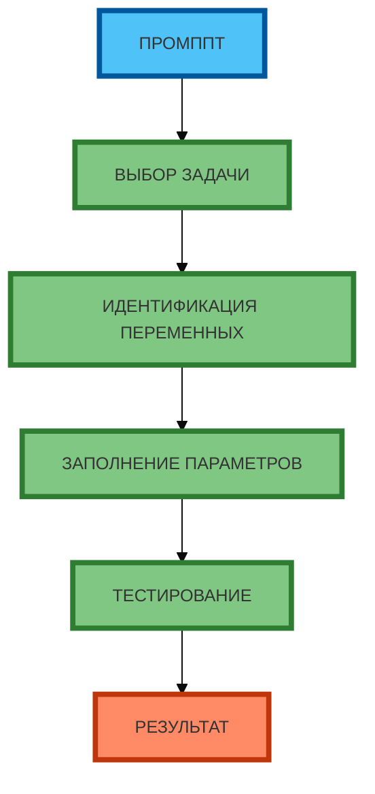

# Схема 2: «Алгоритм адаптации мастерпромпта» (flowchart, линейная, сверху вниз)

**Рисунок 2.** «Алгоритм адаптации мастерпромпта» (flowchart). **Линейная зависимость** (сверху вниз): ПРОМПТ → ВЫБОР ЗАДАЧИ → ИДЕНТИФИКАЦИЯ ПЕРЕМЕННЫХ → ЗАПОЛНЕНИЕ ПАРАМЕТРОВ → ТЕСТИРОВАНИЕ → РЕЗУЛЬТАТ. Компактная 1:1, текст полный, цвета и рамки 4px. Прямые стрелки.