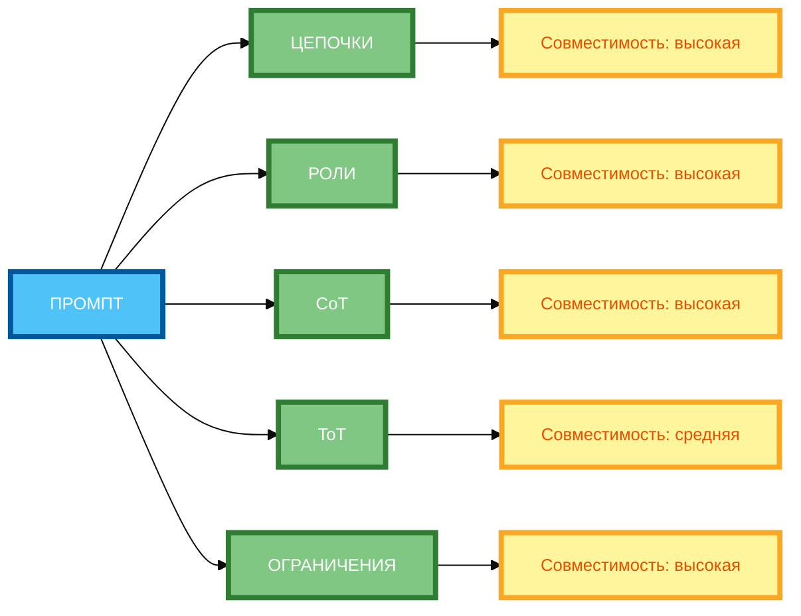

# Комбинирование техник: как создать сложный промпт

В предыдущей статье вы узнали, как использовать мастерпромпты для создания универсальных шаблонов. Но даже если вы создали мастерпромпт, **он всё равно решает только один класс задач**. В этой статье вы научитесь **комбинировать разные техники** промпт-инжиниринга для создания **сложных промптов**, которые могут решать **комплексные задачи** с высокой точностью и креативностью.

## Зачем комбинировать техники: решение комплексных задач, повышение точности и креативности

**Комбинирование техник** — это метод, при котором вы **объединяете несколько техник промпт-инжиниринга** в одном промпте для решения **комплексных задач**.

**Зачем комбинировать техники:**

- **Решение комплексных задач** — одна техника может быть недостаточной для сложной задачи.
- **Повышение точности** — разные техники компенсируют слабости друг друга.
- **Повышение креативности** — комбинация техник позволяет генерировать более разнообразные и качественные результаты.
- **Автоматизация** — сложный промпт может выполнять несколько задач автоматически.

**Пример без комбинирования:**

```
Напиши стратегию продвижения нового продукта на рынке.
```

**Результат:** Один общий ответ, который может быть поверхностным или неполным.

**Пример с комбинированием:**

```
Создай стратегию продвижения нового продукта на рынке. Выполни 5 шагов:

Шаг 1: Определи целевую аудиторию (возраст, пол, интересы, проблемы).
Шаг 2: Предложи 3 канала продвижения (с обоснованием выбора).
Шаг 3: Составь график публикаций на месяц (с указанием дат и форматов).
Шаг 4: Рассуждай пошагово о каждой стратегии (Chain-of-Thought).
Шаг 5: Выведи результат в формате таблицы с этапами.

Каждый шаг должен быть выполнен последовательно. Результат предыдущего шага используй для следующего.
```

**Результат:** Комплексная стратегия, которая включает анализ аудитории, выбор каналов, график публикаций, обоснование и структурированный вывод.

## Какие техники можно сочетать: цепочки, роли, метапромпты, CoT, Tree-of-Thoughts и др.

**1. Цепочки промптов + Роли**

**Пример:**

```
Ты — маркетолог. Выполни 3 шага:

Шаг 1: Определи целевую аудиторию.
Шаг 2: Предложи 3 канала продвижения.
Шаг 3: Составь график публикаций на месяц.
```

**2. Цепочки промптов + Chain-of-Thought (CoT)**

**Пример:**

```
Выполни 3 шага последовательно:

Шаг 1: Определи целевую аудиторию. Рассуждай пошагово.
Шаг 2: Предложи 3 канала продвижения. Рассуждай пошагово.
Шаг 3: Составь график публикаций на месяц. Рассуждай пошагово.
```

**3. Цепочки промптов + Ограничения**

**Пример:**

```
Выполни 3 шага последовательно:

Шаг 1: Определи целевую аудиторию.
Шаг 2: Предложи 3 канала продвижения.
Шаг 3: Составь график публикаций на месяц.

Ограничения: бюджет до 100 000 руб., срок — 2 недели.
```

**4. Роли + Tree-of-Thoughts**

**Пример:**

```
Ты — маркетолог. Придумай 3 стратегии продвижения. Для каждой стратегии оцени по критериям: бюджет, эффективность, реализуемость. Выбери лучшую.
```

**5. Метапромпт + Self-Check**

**Пример:**

```
Создай метапромпт для генерации промптов по теме «Написание постов для соцсетей».

Правила:
1. Тон: дружелюбный.
2. Объём: 150–200 слов.
3. Структура: 3 абзаца + призыв к действию.

После создания метапромпта проверь его по критериям:
1. Полнота правил.
2. Понятность примеров.
3. Чёткость ограничений.

Если есть ошибки, исправь их и выведи финальный вариант.
```

## Алгоритм создания сложного промпта: анализ задачи → выбор техник → интеграция → тестирование

**Алгоритм:**

1. **Анализ задачи** — определите, какие подзадачи нужно решить.
2. **Выбор техник** — выберите 3–5 техник, которые подходят для каждой подзадачи.
3. **Интеграция** — объедините техники в единый промпт.
4. **Тестирование** — протестируйте промпт на примере.
5. **Доработка** — оптимизируйте промпт при необходимости.

**Пример алгоритма:**

```
Задача: «Создай стратегию продвижения нового продукта на рынке.»

Анализ задачи:
- Определить целевую аудиторию.
- Предложить каналы продвижения.
- Составить график публикаций.
- Обосновать стратегию.
- Вывести результат в структурированном виде.

Выбор техник:
- Ролевая игра (маркетолог + аналитик).
- Цепочка промптов (анализ → идеи → план).
- Chain-of-Thought (обоснование стратегии).
- Ограничения (бюджет, сроки).
- Формат вывода (таблица с этапами).

Интеграция:
[см. пример ниже]

Тестирование:
Протестировать на примере продукта.

Доработка:
Оптимизировать при необходимости.
```

## Принципы совместимости техник (какие комбинации работают лучше)

**Принцип 1: Цепочки промптов + Chain-of-Thought**

**Почему работает:** Цепочки обеспечивают структуру, CoT — обоснование.

**Пример:**

```
Выполни 3 шага последовательно:

Шаг 1: Определи целевую аудиторию. Рассуждай пошагово.
Шаг 2: Предложи 3 канала продвижения. Рассуждай пошагово.
Шаг 3: Составь график публикаций на месяц. Рассуждай пошагово.
```

**Принцип 2: Роли + Tree-of-Thoughts**

**Почему работает:** Роли обеспечивают экспертизу, ToT — исследование вариантов.

**Пример:**

```
Ты — маркетолог. Придумай 3 стратегии продвижения. Для каждой стратегии оцени по критериям: бюджет, эффективность, реализуемость. Выбери лучшую.
```

**Принцип 3: Метапромпт + Self-Check**

**Почему работает:** Метапромпт обеспечивает универсальность, Self-Check — качество.

**Пример:**

```
Создай метапромпт для генерации промптов по теме «Написание постов для соцсетей».

Правила:
1. Тон: дружелюбный.
2. Объём: 150–200 слов.
3. Структура: 3 абзаца + призыв к действию.

После создания метапромпта проверь его по критериям:
1. Полнота правил.
2. Понятность примеров.
3. Чёткость ограничений.

Если есть ошибки, исправь их и выведи финальный вариант.
```

**Принцип 4: Ограничения + Формат вывода**

**Почему работает:** Ограничения обеспечивают контроль, формат — структурированность.

**Пример:**

```
Напиши стратегию продвижения. Ограничения: бюджет до 100 000 руб., срок — 2 недели. Выведи результат в формате таблицы с этапами.
```

## Примеры сложных промптов с 3–5 техниками

**Пример 1: Стратегия продвижения (5 техник)**

```
Создай стратегию продвижения нового продукта на рынке. Продукт: фитнес-приложение для молодёжи 18–25 лет. Цена: 299 руб./мес. Бесплатный период: 14 дней.

Выполни 5 шагов последовательно:

## Шаг 1: Определи целевую аудиторию (ролевая игра + Chain-of-Thought)
Ты — маркетолог. Определи целевую аудиторию по критериям: возраст, пол, интересы, проблемы, потребности. Рассуждай пошагово.

## Шаг 2: Предложи 3 канала продвижения (Tree-of-Thoughts + Ограничения)
На основе аудитории предложи 3 канала продвижения. Для каждой ветви оцени по критериям: бюджет, эффективность, реализуемость. Ограничения: бюджет до 100 000 руб., срок — 2 недели.

## Шаг 3: Составь график публикаций на месяц (Цепочка промптов + Формат вывода)
На основе каналов составь график публикаций на месяц (30 дней). Для каждого дня укажи: дата, канал, формат контента, тема, цель. Выведи результат в формате таблицы.

## Шаг 4: Обоснуй стратегию (Chain-of-Thought)
Рассуждай пошагово о каждой стратегии. Объясни, почему ты выбрал именно эти каналы и этот график.

## Шаг 5: Проверь результат (Self-Check)
Проверь стратегию по критериям:
1. Полнота: все ли аспекты освещены?
2. Реализуемость: можно ли внедрить эту стратегию за 2 недели с бюджетом 100 000 руб.?
3. Эффективность: приведёт ли эта стратегия к цели?

Если есть ошибки, исправь их и выведи финальную версию.

Каждый шаг должен быть выполнен последовательно. Результат предыдущего шага используй для следующего.
```

**Разбор:**

- **Шаг 1:** Ролевая игра (маркетолог) + Chain-of-Thought.
- **Шаг 2:** Tree-of-Thoughts (3 ветви) + Ограничения (бюджет, срок).
- **Шаг 3:** Цепочка промптов + Формат вывода (таблица).
- **Шаг 4:** Chain-of-Thought (обоснование).
- **Шаг 5:** Self-Check (проверка).
- **Порядок:** Последовательный.
- **Связь:** Результат каждого шага передаётся на следующий.

## Типичные ошибки: избыточность, противоречивость, сложность восприятия

**Ошибка 1: Избыточность**

**Некорректно:** 10 техник в одном промпте.

**Почему не работает:** Промпт становится слишком длинным, нейросеть теряет фокус.

**Корректно:** 3–5 техник в одном промпте.

**Ошибка 2: Противоречивость**

**Некорректно:** «Используй Chain-of-Thought» + «Не рассуждай, сразу давай ответ.»

**Почему не работает:** Противоречивые инструкции.

**Корректно:** «Используй Chain-of-Thought» + «Рассуждай пошагово.»

**Ошибка 3: Сложность восприятия**

**Некорректно:** Сложная структура без подзаголовков.

**Почему не работает:** Промпт трудно читать и понимать.

**Корректно:** Используй подзаголовки для разделения шагов.

**Ошибка 4: Отсутствие инструкций по порядку**

**Некорректно:** «Выполни 3 шага: 1) … 2) … 3) …»

**Почему не работает:** Нет явного указания на порядок выполнения.

**Корректно:** «Выполни 3 шага последовательно: 1) … 2) … 3) …»

## Практические советы по оптимизации сложных промптов

**Совет 1: Чётко сформулируй задачу**

Прежде чем создавать сложный промпт, чётко сформулируй, **какую задачу** нужно решить.

**Совет 2: Раздели задачу на подзадачи (если нужно)**

Если задача сложная, разбей её на подзадачи.

**Совет 3: Выбери 3–5 подходящих техник**

Не пытайся использовать все техники сразу. Выбери 3–5 техник, которые подходят для вашей задачи.

**Совет 4: Проверь их совместимость (нет ли противоречий)**

Убедись, что техники не противоречат друг другу.

**Совет 5: Интегрируй техники в единый промпт**

Объедини техники в единый промпт с чёткой структурой.

**Совет 6: Добавь инструкции по порядку выполнения**

Укажи, в каком порядке должны выполняться шаги.

**Совет 7: Протестируй на примере и оптимизируй**

Протестируйте промпт на небольшом примере и оптимизируйте при необходимости.

## Схема 1: «Матрица совместимости техник» (grid)



**Рисунок 1.** «Матрица совместимости техник» (grid). **3 ряда**: Промпт слева, 5 техник в среднем ряду (ЦЕПОЧКИ, РОЛИ, CoT, ToT, ОГРАНИЧЕНИЯ), совместимость справа. Компактная 1:1, текст полный, цвета и рамки 4px. Расширение слева направо, не длинная по горизонтали.

## Схема 2: «Алгоритм создания сложного промпта» (flowchart)


**Рисунок 2.** «Алгоритм создания сложного промпта» (flowchart). **3 ряда**: Промпт слева, 5 этапов в среднем ряду (АНАЛИЗ ЗАДАЧИ → ВЫБОР ТЕХНИК → ИНТЕГРАЦИЯ → ТЕСТИРОВАНИЕ → ДОРАБОТКА), Результат справа. Компактная 1:1, текст полный, цвета и рамки 4px. Расширение слева направо, не длинная по горизонтали.

## Таблица: «Примеры комбинированных промптов»

| Задача | Используемые техники | Структура промпта | Результат |
|--------|----------------------|-------------------|-----------|
| **Создать стратегию продвижения** | Роли + Цепочка + CoT + Ограничения + Формат | 5 шагов с ролями, цепочкой, CoT, ограничениями, форматом | Комплексная стратегия с обоснованием |
| **Написать статью** | Цепочка + CoT + Self-Check | 4 шага с цепочкой, CoT, Self-Check | Готовая статья с проверкой |
| **Анализировать данные** | Цепочка + CoT + Ограничения | 3 шага с цепочкой, CoT, ограничениями | Анализ с обоснованием |
| **Придумать идеи** | ToT + Ограничения + Формат | 3 ветви с ToT, ограничениями, форматом | 3 идеи с оценкой |

**Рисунок 3.** «Примеры комбинированных промптов». Таблица содержит 4 задачи с техниками, структурой и результатом.

## Практическое задание

**Задание:** Разработайте комплексный промпт из 5 техник для задачи «Создай стратегию продвижения нового продукта на рынке».

**Техники:**

1. Ролевая игра (маркетолог + аналитик).
2. Цепочка промптов (анализ → идеи → план).
3. Chain-of-Thought (обоснование стратегии).
4. Ограничения (бюджет, сроки).
5. Формат вывода (таблица с этапами).

**Чек-лист для самопроверки:**

- [ ] Чётко сформулирована задача
- [ ] Разделена на подзадачи (если нужно)
- [ ] Выбраны 3–5 подходящих техник
- [ ] Проверена совместимость (нет ли противоречий)
- [ ] Интегрированы техники в единый промпт
- [ ] Добавлены инструкции по порядку выполнения
- [ ] Протестировано на примере и оптимизировано
- [ ] Промпт содержит конкретные инструкции

## Заключение

Комбинирование техник — это ключ к решению комплексных задач. Главное — чётко анализировать задачу, выбирать совместимые техники, интегрировать их в единый промпт и тестировать. В следующей статье вы узнаете, как использовать промпты с памятью для сохранения контекста диалога.