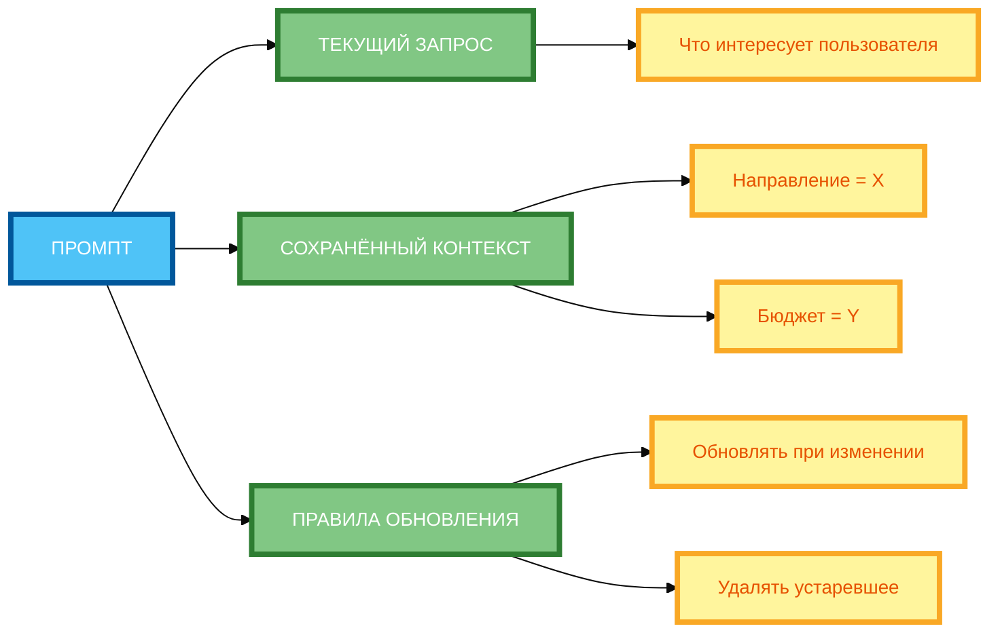

# Промпты с памятью: сохранение контекста диалога

В предыдущей статье вы узнали, как комбинировать разные техники промпт-инжиниринга для создания сложных промптов. Но даже если вы создали сложный промпт, **нейросеть может «забыть» контекст предыдущих сообщений** в длинном диалоге. В этой статье вы научитесь использовать **промпты с памятью** — технику, которая позволяет **сохранять контекст диалога** и **накапливать знания** между сообщениями.

## Зачем нужна память в промптах: непрерывность диалога, накопление знаний, персонализация

**Память в промптах** — это способ **сохранять информацию** между сообщениями в диалоге, чтобы нейросеть могла **использовать контекст предыдущих сообщений** в текущем ответе.

**Зачем нужна память:**

- **Непрерывность диалога** — нейросеть помнит, о чём шла речь раньше.
- **Накопление знаний** — нейросеть накапливает информацию о пользователе и его предпочтениях.
- **Персонализация** — нейросеть адаптирует ответы под конкретного пользователя.

**Пример без памяти:**

```
Пользователь: «Я планирую отпуск в сентябре.»
Нейросеть: «Хорошо, в каком направлении вы хотите поехать?»

Пользователь: «Хочу в Европу.»
Нейросеть: «Хорошо, в каком городе?»

Пользователь: «В Париже.»
Нейросеть: «Хорошо, какие даты?»
```

**Результат:** Каждый ответ нейросети **не учитывает контекст предыдущих сообщений**. Пользователь вынужден повторять информацию.

**Пример с памятью:**

```
Пользователь: «Я планирую отпуск в сентябре.»
Нейросеть: «Хорошо, в каком направлении вы хотите поехать?»

Пользователь: «Хочу в Европу.»
Нейросеть: «Помни, что вы планируете отпуск в сентябре в Европу. В каком городе?»

Пользователь: «В Париже.»
Нейросеть: «Помни, что вы планируете отпуск в сентябре в Париже. Какие даты?»
```

**Результат:** Нейросеть **помнит контекст** и не заставляет пользователя повторять информацию.

## Способы сохранения контекста: явное указание («Помни, что…»), передача истории диалога, использование переменных

**1. Явное указание («Помни, что…»)**

**Формулировка:** «Помни, что [информация].»

**Пример:**

```
Помни, что мы выбрали Париж в качестве направления.
```

**2. Передача истории диалога**

**Формулировка:** «Предыдущие сообщения: [история].»

**Пример:**

```
Предыдущие сообщения:
Пользователь: «Я планирую отпуск в сентябре.»
Нейросеть: «Хорошо, в каком направлении?»
Пользователь: «Хочу в Европу.»
```

**3. Использование переменных**

**Формулировка:** «[ПЕРЕМЕННАЯ] = [значение].»

**Пример:**

```
Направление = Париж
Бюджет = 5000 руб/сутки
Длительность = 7 дней
```

**4. Комбинирование способов**

**Пример:**

```
Помни, что:
- Направление = Париж
- Бюджет = 5000 руб/сутки
- Длительность = 7 дней

Предыдущие сообщения:
Пользователь: «Я планирую отпуск в сентябре.»
Нейросеть: «Хорошо, в каком направлении?»
Пользователь: «Хочу в Европу.»
```

## Управление долгосрочной памятью: обновление, удаление устаревшей информации, приоритеты

**1. Обновление контекста**

**Формулировка:** «Теперь [новая информация].»

**Пример:**

```
Теперь вместо Парижа — Барселона.
```

**2. Удаление устаревшей информации**

**Формулировка:** «Забудь о [устаревшая информация].»

**Пример:**

```
Забудь о предыдущем направлении (Париж).
```

**3. Приоритеты**

**Формулировка:** «Приоритет: [что важнее].»

**Пример:**

```
Приоритет: бюджет важнее комфорта.
```

**4. Структурирование памяти**

**Формулировка:** «[ПЕРЕМЕННАЯ] = [значение].»

**Пример:**

```
Направление = X
Бюджет = Y
Длительность = Z
```

## Примеры промптов с памятью для разных задач (чат-боты, обучение, аналитика)

**Пример 1: Чат-бот (полный рабочий промпт)**

```
Ты — чат-бот для планирования отпуска. Помни контекст диалога.

Пользователь: «Я планирую отпуск в сентябре.»
Нейросеть: «Хорошо, в каком направлении вы хотите поехать?»

Пользователь: «Хочу в Европу.»
Нейросеть: «Помни, что вы планируете отпуск в сентябре в Европу. В каком городе?»

Пользователь: «В Париже.»
Нейросеть: «Помни, что вы планируете отпуск в сентябре в Париже. Какие даты?»

Пользователь: «С 15 по 22 сентября.»
Нейросеть: «Помни, что вы планируете отпуск в Париже с 15 по 22 сентября. Какой бюджет на сутки?»

Пользователь: «5000 руб/сутки.»
Нейросеть: «Помни, что вы планируете отпуск в Париже с 15 по 22 сентября с бюджетом 5000 руб/сутки. Какой тип отдыха предпочитаете?»

Пользователь: «Культурный туризм.»
Нейросеть: «Помни, что вы планируете культурный туризм в Париже с 15 по 22 сентября с бюджетом 5000 руб/сутки. Предложить 3 отеля и 3 достопримечательности.»
```

**Разбор:**

- **Память:** «Помни, что [информация].»
- **Накопление:** каждый ответ нейросети включает контекст предыдущих сообщений.
- **Персонализация:** ответы адаптируются под конкретного пользователя.

**Пример 2: Обучение (полный рабочий промпт)**

```
Ты — репетитор по математике. Помни контекст диалога.

Пользователь: «Я изучаю алгебру.»
Нейросеть: «Хорошо, какая тема вас интересует?»

Пользователь: «Квадратные уравнения.»
Нейросеть: «Помни, что вы изучаете алгебру, тема — квадратные уравнения. Какой уровень подготовки?»

Пользователь: «Начинающий.»
Нейросеть: «Помни, что вы начинающий студент, изучаете алгебру, тема — квадратные уравнения. Объяснить формулу и привести пример.»

Пользователь: «Объясни формулу.»
Нейросеть: «Помни, что вы начинающий студент, изучаете алгебру, тема — квадратные уравнения. Формула: ax² + bx + c = 0. Пример: x² + 5x + 6 = 0.»

Пользователь: «Решить уравнение.»
Нейросеть: «Помни, что вы начинающий студент, изучаете алгебру, тема — квадратные уравнения. Решение: x = -2, x = -3.»
```

**Разбор:**

- **Память:** «Помни, что [информация].»
- **Накопление:** нейросеть помнит уровень подготовки студента.
- **Персонализация:** объяснения адаптируются под уровень студента.

**Пример 3: Аналитика (полный рабочий промпт)**

```
Ты — аналитик данных. Помни контекст диалога.

Пользователь: «Анализируй данные о продажах.»
Нейросеть: «Хорошо, какие данные у вас есть?»

Пользователь: «Таблица с колонками „Месяц“, „Выручка“, „Затраты“, „Прибыль“.»
Нейросеть: «Помни, что данные: таблица с колонками „Месяц“, „Выручка“, „Затраты“, „Прибыль“. Какой период анализа?»

Пользователь: «3 месяца.»
Нейросеть: «Помни, что данные: таблица с колонками „Месяц“, „Выручка“, „Затраты“, „Прибыль“, период — 3 месяца. Какой тип анализа?»

Пользователь: «Тренды.»
Нейросеть: «Помни, что данные: таблица с колонками „Месяц“, „Выручка“, „Затраты“, „Прибыль“, период — 3 месяца, тип анализа — тренды. Проанализировать тренды.»

Пользователь: «Сделать выводы.»
Нейросеть: «Помни, что данные: таблица с колонками „Месяц“, „Выручка“, „Затраты“, „Прибыль“, период — 3 месяца, тип анализа — тренды. Сделать выводы.»
```

**Разбор:**

- **Память:** «Помни, что [информация].»
- **Накопление:** нейросеть помнит структуру данных и тип анализа.
- **Персонализация:** анализ адаптируется под конкретные данные.

## Технические аспекты: лимиты контекста, токенизация, кэширование

**Важно:** Мы не будем углубляться в технические детали, но важно понимать, что память в промптах имеет **ограничения**.

**1. Лимиты контекста**

Каждая модель имеет **максимальный размер контекста** (например, 4096 токенов). Если промпт + история диалога превышают этот лимит, модель **обрежет** старые сообщения.

**2. Токенизация**

Каждое слово или символ преобразуется в **токены**. Чем длиннее история диалога, тем больше токенов.

**3. Кэширование**

Некоторые платформы позволяют **кэшировать** контекст, чтобы не передавать его каждый раз.

**4. Стратегии управления памятью**

- **Сжатие:** суммировать старые сообщения.
- **Приоритизация:** сохранять только важную информацию.
- **Иерархическая память:** разные уровни хранения (краткосрочная, долгосрочная).

## Комбинирование с другими техниками (цепочки, роли)

**Комбинирование 1: Промпты с памятью + Цепочки промптов**

```
Шаг 1: Выбери 3 направления для отпуска в сентябре.

Шаг 2: Помни выбранные направления. Для каждого предложи 3 отеля по бюджету 5000 руб/сутки.

Шаг 3: На основе предыдущих ответов составь маршрут на 7 дней для выбранного направления.

Каждый шаг должен быть выполнен последовательно. Результат предыдущего шага используй для следующего.
```

**Комбинирование 2: Промпты с памятью + Роли**

```
Ты — консультант по туризму. Помни контекст диалога.

Пользователь: «Я планирую отпуск в сентябре.»
Нейросеть: «Хорошо, в каком направлении вы хотите поехать?»

Пользователь: «Хочу в Европу.»
Нейросеть: «Помни, что вы планируете отпуск в сентябре в Европу. В каком городе?»

Пользователь: «В Париже.»
Нейросеть: «Помни, что вы планируете отпуск в сентябре в Париже. Какие даты?»
```

## Практические рекомендации по управлению памяти в промптах

**Рекомендация 1: Явно указывай, что нужно запомнить**

**Некорректно:** «Пользователь сказал, что хочет в Париж.»

**Корректно:** «Помни, что мы выбрали Париж в качестве направления.»

**Рекомендация 2: Ограничивай объём сохраняемой информации**

**Некорректно:** Сохранять весь диалог.

**Корректно:** Сохранять только **ключевые факты**.

**Рекомендация 3: Обновляй контекст при изменении условий**

**Некорректно:** «Мы выбрали Париж.»

**Корректно:** «Теперь вместо Парижа — Барселона.»

**Рекомендация 4: Удаляй устаревшие данные, если они мешают**

**Некорректно:** Сохранять устаревшую информацию.

**Корректно:** «Забудь о предыдущем направлении (Париж).»

**Рекомендация 5: Используй переменные для структурирования памяти**

**Некорректно:** «Мы выбрали Париж, бюджет 5000 руб/сутки, длительность 7 дней.»

**Корректно:** «Направление = Париж, Бюджет = 5000 руб/сутки, Длительность = 7 дней.»

**Рекомендация 6: Тестируйте память на разных сценариях**

Протестируйте, как нейросеть справляется с **длинными диалогами** и **изменением контекста**.

## Схема 1: «Цикл управления памятью» (flowchart)


**Рисунок 1.** «Цикл управления памятью» (flowchart). **3 ряда**: Промпт слева, 4 этапа в среднем ряду (ЗАПРОС → СОХРАНЕНИЕ КОНТЕКСТА → ИСПОЛЬЗОВАНИЕ → ОБНОВЛЕНИЕ/УДАЛЕНИЕ), Результат справа. Компактная 1:1, текст полный, цвета и рамки 4px. Расширение слева направо, не длинная по горизонтали.

## Схема 2: «Структура промпта с памятью» (mind map)



**Рисунок 2.** «Структура промпта с памятью» (mind map). **3 ряда**: Промпт слева, 3 компонента в среднем ряду (ТЕКУЩИЙ ЗАПРОС, СОХРАНЁННЫЙ КОНТЕКСТ, ПРАВИЛА ОБНОВЛЕНИЯ), детали справа. Компактная 1:1, текст полный, цвета и рамки 4px. Расширение слева направо, не длинная по горизонтали.

## Таблица: «Правила управления памятью»

| Правило | Описание | Пример применения |
|---------|----------|-------------------|
| **Явно указывай, что нужно запомнить** | Используй формулировку «Помни, что…» | «Помни, что мы выбрали Париж.» |
| **Ограничивай объём сохраняемой информации** | Сохраняй только ключевые факты | «Направление = Париж, Бюджет = 5000 руб/сутки.» |
| **Обновляй контекст при изменении условий** | Используй формулировку «Теперь…» | «Теперь вместо Парижа — Барселона.» |
| **Удаляй устаревшие данные, если они мешают** | Используй формулировку «Забудь о…» | «Забудь о предыдущем направлении (Париж).» |
| **Используй переменные для структурирования памяти** | Используй формат «[ПЕРЕМЕННАЯ] = [значение]» | «Направление = X, Бюджет = Y.» |

**Рисунок 3.** «Правила управления памяти». Таблица содержит 5 правил с описанием и примером применения.

## Практическое задание

**Задание:** Создайте серию из 3 промптов для диалога с нейросетью о планировании отпуска.

**Требования:**

- Промпт 1: «Выбери 3 направления для отпуска в сентябре.»
- Промпт 2: «Учитывай выбранные направления. Для каждого предложи 3 отеля по бюджету 5000 руб/сутки.»
- Промпт 3: «На основе предыдущих ответов составь маршрут на 7 дней для выбранного направления.»

**Чек-лист для самопроверки:**

- [ ] Явно указывай, что нужно запомнить («Помни, что мы выбрали Париж»)
- [ ] Ограничивай объём сохраняемой информации (ключевые факты, не весь диалог)
- [ ] Обновляй контекст при изменении условий («Теперь вместо Парижа — Барселона»)
- [ ] Удаляй устаревшие данные, если они мешают
- [ ] Используй переменные для структурирования памяти («Направление = X, Бюджет = Y»)
- [ ] Каждый промпт учитывает контекст предыдущих сообщений
- [ ] Промпты связаны между собой логически
- [ ] Результаты накапливаются и используются в последующих промптах

## Заключение

Промпты с памятью позволяют создавать непрерывные и персонализированные диалоги с нейросетью. Главное — явно указывать, что нужно запомнить, ограничивать объём сохраняемой информации, обновлять контекст при изменении условий и использовать переменные для структурирования памяти. В следующей статье вы узнаете, как использовать промпты для генерации идей с помощью SCAMPER, аналогий и случайных слов.