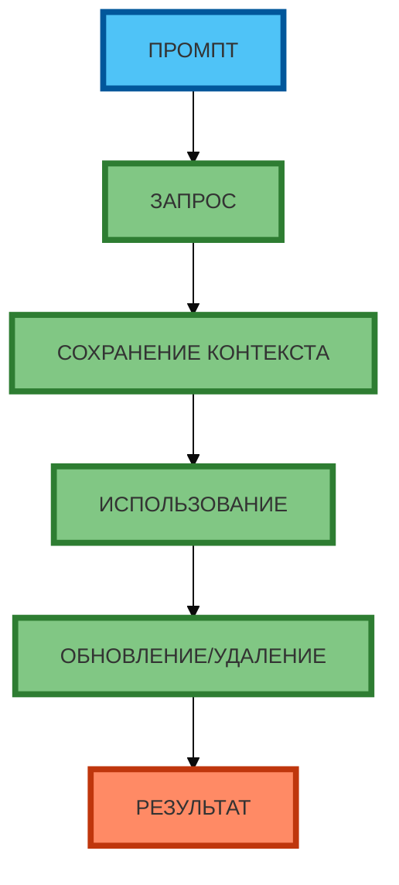

# Схема 1: «Цикл управления памятью» (flowchart, линейная, сверху вниз)

**Рисунок 1.** «Цикл управления памятью» (flowchart). **Ровно 6 элементов** (сверху вниз): ПРОМПТ → ЗАПРОС → СОХРАНЕНИЕ КОНТЕКСТА → ИСПОЛЬЗОВАНИЕ → ОБНОВЛЕНИЕ/УДАЛЕНИЕ → РЕЗУЛЬТАТ. Компактная 1:1, текст полный, цвета и рамки 4px. Прямые стрелки.