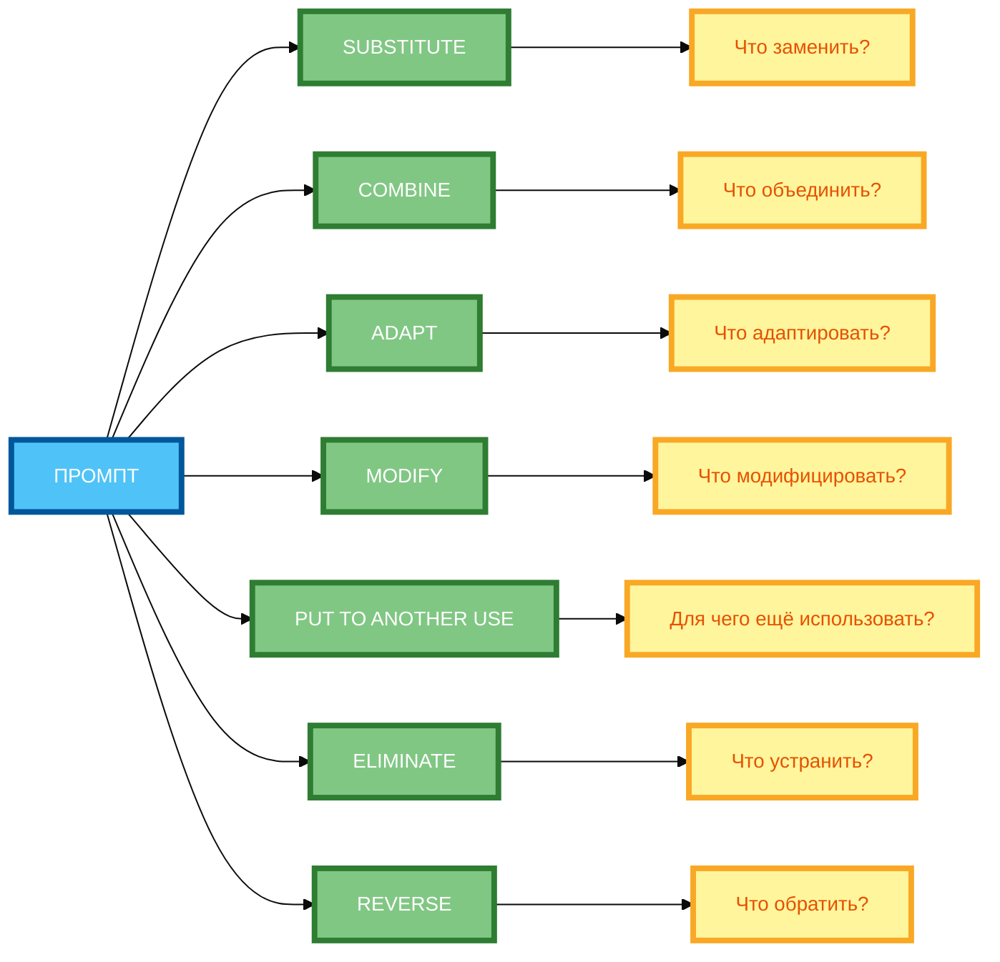

# Промпты для генерации идей: SCAMPER, аналогии, случайные слова

В предыдущей статье вы узнали, как использовать промпты с памятью для сохранения контекста диалога. Но даже если вы сохраняете контекст, **нейросеть может выдавать шаблонные ответы**, если не стимулировать её креативность. В этой статье вы научитесь использовать **техники креативности** — SCAMPER, аналогии и случайные слова — для **генерации идей** и **стимуляции ассоциативного мышления**.

## Техники креативности в промптах: SCAMPER (Substitute, Combine, Adapt, Modify, Put to another use, Eliminate, Reverse), аналогии, случайные слова

**Техники креативности** — это методы, которые помогают **выходить за рамки шаблонного мышления** и генерировать **новые идеи**.

**1. SCAMPER**

SCAMPER — это акроним из 7 элементов:

- **S**ubstitute — заменить.
- **C**ombine — объединить.
- **A**dapt — адаптировать.
- **M**odify — модифицировать.
- **P**ut to another use — использовать по-другому.
- **E**liminate — устранить.
- **R**everse — обратить.

**2. Аналогии**

**Аналогии** — это поиск решений через **сравнение с другими областями**.

**Пример:** «Как бы решил эту задачу эксперт из другой области?»

**3. Случайные слова**

**Случайные слова** — это стимуляция **ассоциативного мышления** через включение случайных слов в промпт.

**Пример:** «Используй слова „облако“, „магнит“, „лестница“ для генерации идеи.»

## Как применять SCAMPER: разбор каждого элемента и примеры промптов

**1. Substitute (Заменить)**

**Формулировка:** «Что можно заменить?»

**Пример:**

```
Что можно заменить в традиционном фитнес-приложении?
```

**2. Combine (Объединить)**

**Формулировка:** «Что можно объединить?»

**Пример:**

```
Что можно объединить в традиционном фитнес-приложении?
```

**3. Adapt (Адаптировать)**

**Формулировка:** «Что можно адаптировать из другой области?»

**Пример:**

```
Что можно адаптировать из сервисов доставки еды для фитнес-приложения?
```

**4. Modify (Модифицировать)**

**Формулировка:** «Что можно модифицировать?»

**Пример:**

```
Что можно модифицировать в традиционном фитнес-приложении?
```

**5. Put to another use (Использовать по-другому)**

**Формулировка:** «Для чего ещё можно использовать?»

**Пример:**

```
Для чего ещё можно использовать фитнес-приложение?
```

**6. Eliminate (Устранить)**

**Формулировка:** «Что можно устранить?»

**Пример:**

```
Что можно устранить в традиционном фитнес-приложении?
```

**7. Reverse (Обратить)**

**Формулировка:** «Что можно обратить?»

**Пример:**

```
Что можно обратить в традиционном фитнес-приложении?
```

## Аналогии: поиск решений через сравнение с другими областями

**Формулировка:** «Как бы решил эту задачу [эксперт/персонаж/компания]?»

**Пример:**

```
Как бы решил эту задачу сервис доставки еды?
```

**Пример с разбором:**

```
Задача: Создать фитнес-приложение.

Аналогия: «Как бы решил эту задачу сервис доставки еды?»

Решение: «Приложение могло бы „доставлять“ персонализированные тренировки, как еда доставляется на дом.»
```

## Случайные слова: стимуляция ассоциативного мышления

**Формулировка:** «Используй слова [слово 1], [слово 2], [слово 3] для генерации идеи.»

**Пример:**

```
Используй слова «облако», «магнит», «лестница» для генерации идеи фитнес-приложения.
```

**Пример с разбором:**

```
Задача: Создать фитнес-приложение.

Случайные слова: «облако», «магнит», «лестница».

Идея: «Приложение, которое „притягивает“ пользователей к целям, как магнит, и помогает „подниматься“ по „лестнице“ прогресса, „паря“ над трудностями, как облако.»
```

## Комбинирование техник для усиления креативности

**Пример комбинации:**

```
Создай идею фитнес-приложения. Примени SCAMPER (Substitute, Combine, Adapt). Используй аналогию с сервисом доставки еды. Включи случайные слова «облако», «магнит», «лестница».

Ограничения: используй только 3 цвета.
```

**Результат:** Идея, которая объединяет несколько техник креативности.

## Примеры генерации идей для бизнеса, контента, дизайна

**Пример 1: Бизнес**

```
Создай идею для нового мобильного приложения. Примени SCAMPER (Substitute, Combine, Adapt). Используй аналогию с сервисом доставки еды. Включи случайные слова «облако», «магнит», «лестница».
```

**Пример 2: Контент**

```
Создай идею для статьи о цифровом детоксе. Примени SCAMPER (Eliminate, Reverse). Используй аналогию с йогой. Включи случайные слова «лес», «река», «гора».
```

**Пример 3: Дизайн**

```
Создай концепцию логотипа для эко-бренда. Примени SCAMPER (Modify, Put to another use). Используй аналогию с природой. Включи случайные слова «лист», «вода», «солнце».
```

## Практические рекомендации по формулировке креативных промптов

**Рекомендация 1: Используй SCAMPER для систематического подхода**

Задай вопрос по каждому элементу SCAMPER.

**Рекомендация 2: Используй аналогии для нестандартных решений**

«Как бы решил эту задачу [эксперт/персонаж/компания]?»

**Рекомендация 3: Используй случайные слова для стимуляции ассоциаций**

Включи 1–3 случайных слова в промпт.

**Рекомендация 4: Используй ролевую игру**

«Представь, что ты [креативный директор Apple]…»

**Рекомендация 5: Используй ограничения**

«Создай идею, используя только 3 цвета.»

**Рекомендация 6: Комбинируй техники**

Объедини 2 несвязанные идеи в одну.

## Схема 1: «Процесс SCAMPER» (wheel diagram)



**Рисунок 1.** «Процесс SCAMPER» (wheel diagram). **3 ряда**: Промпт слева, 7 элементов SCAMPER в среднем ряду (SUBSTITUTE, COMBINE, ADAPT, MODIFY, PUT TO ANOTHER USE, ELIMINATE, REVERSE), вопросы справа. Компактная 1:1, текст полный, цвета и рамки 4px. Расширение слева направо, не длинная по горизонтали.

## Схема 2: «Алгоритм генерации идей через аналогии» (flowchart)


**Рисунок 2.** «Алгоритм генерации идей через аналогии» (flowchart). **3 ряда**: Промпт слева, 3 этапа в среднем ряду (ПРОБЛЕМА → ПОИСК АНАЛОГИЙ → АДАПТАЦИЯ РЕШЕНИЙ), Результат справа. Компактная 1:1, текст полный, цвета и рамки 4px. Расширение слева направо, не длинная по горизонтали.

## Таблица: «6 приёмов креативных промптов»

| Приём | Описание | Шаблон промпта | Пример |
|-------|----------|----------------|--------|
| **SCAMPER** | Задай вопрос по каждому элементу | «Что можно заменить/объединить/адаптировать…?» | «Что можно заменить в традиционном фитнес-приложении?» |
| **Аналогии** | «Как бы решил эту задачу [эксперт/персонаж/компания]?» | «Как бы решил эту задачу сервис доставки еды?» | «Как бы решил эту задачу сервис доставки еды?» |
| **Случайные слова** | Включи 1–3 случайных слова в промпт | «Используй слова [слово 1], [слово 2], [слово 3]…» | «Используй слова „облако“, „магнит“, „лестница“…» |
| **Ролевая игра** | «Представь, что ты [креативный директор Apple]…» | «Представь, что ты креативный директор Apple…» | «Представь, что ты креативный директор Apple…» |
| **Ограничения** | «Создай идею, используя только [ограничение]…» | «Создай идею, используя только 3 цвета.» | «Создай идею, используя только 3 цвета.» |
| **Комбинация** | Объедини 2 несвязанные идеи в одну | «Объедини идею [идея 1] и идею [идея 2].» | «Объедини идею фитнеса и идею доставки еды.» |

**Рисунок 3.** «6 приёмов креативных промптов». Таблица содержит 6 приёмов с описанием, шаблоном и примером.

## Практическое задание

**Задание:** Сгенерируйте 15 идей для нового мобильного приложения через 3 техники.

**Требования:**

1. **SCAMPER** — применить 3 элемента метода (Substitute, Combine, Adapt).
2. **Аналогии** — сравнить с сервисами доставки еды.
3. **Случайные слова** — использовать слова «облако», «магнит», «лестница».

**Чек-лист для самопроверки:**

- [ ] SCAMPER: задай вопрос по каждому элементу (Что заменить? Что объединить?)
- [ ] Аналогии: «Как бы решил эту задачу [эксперт/персонаж/компания]?»
- [ ] Случайные слова: включи 1–3 случайных слова в промпт
- [ ] Ролевая игра: «Представь, что ты [креативный директор Apple]…»
- [ ] Ограничения: «Создай идею, используя только 3 цвета»
- [ ] Комбинация: объедини 2 несвязанные идеи в одну
- [ ] Сгенерировано 15 идей (5 от каждой техники)
- [ ] Промпт содержит конкретные инструкции

## Заключение

Техники креативности — SCAMPER, аналогии и случайные слова — позволяют генерировать нестандартные идеи и выходить за рамки шаблонного мышления. Главное — использовать конкретные вопросы, примеры и ограничения. В следующей статье вы узнаете, как использовать промпты для анализа и синтеза информации.