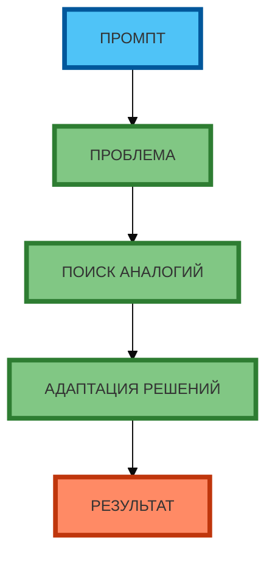

# Схема 2: «Алгоритм генерации идей через аналогии» (flowchart, вертикальная компоновка)

**Рисунок 2.** «Алгоритм генерации идей через аналогии» (flowchart). **Вертикальная компоновка** (сверху вниз): ПРОМПТ → ПРОБЛЕМА → ПОИСК АНАЛОГИЙ → АДАПТАЦИЯ РЕШЕНИЙ → РЕЗУЛЬТАТ. Компактная 1:1, текст полный, цвета и рамки 4px. Прямые стрелки.