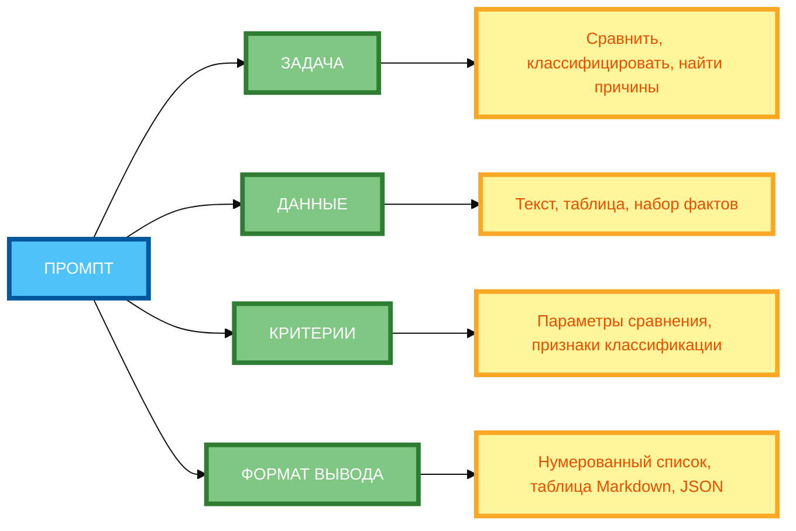

# Промпты для анализа и синтеза: как просить нейросеть анализировать

В предыдущей статье вы узнали, как использовать SCAMPER, аналогии и случайные слова для генерации идей. Но даже если вы генерируете идеи, **нейросеть может выдавать поверхностный анализ**, если не указать чёткие критерии. В этой статье вы научитесь использовать **промпты для анализа и синтеза** — технику, которая позволяет **извлекать информацию**, **выявлять закономерности** и **синтезировать выводы**.

## Суть аналитических промптов: извлечение информации, выявление закономерностей, синтез выводов

**Аналитические промпты** — это промпты, которые направлены на **анализ информации** и **синтез выводов**.

**Суть метода:**

- **Извлечение информации** — выделение ключевых фактов и данных.
- **Выявление закономерностей** — поиск связей, причинно-следственных отношений, корреляций.
- **Синтез выводов** — объединение результатов анализа в coherentные выводы.

**Пример без аналитического промпта:**

```
Проанализируй отзывы о продукте.
```

**Результат:** Общий анализ без конкретных критериев.

**Пример с аналитическим промптом:**

```
Проанализируй отзывы о продукте. Выдели 3 основные проблемы. Для каждой проблемы укажи: описание, количество отзывов, примеры.

Синтезируй выводы: какие проблемы наиболее критичны и требуют приоритетного решения.
```

**Результат:** Структурированный анализ с конкретными выводами.

## Типы задач: сравнение, классификация, причинно-следственные связи, прогнозирование

**1. Сравнение**

**Формулировка:** «Сравни [объект 1] и [объект 2] по критериям: 1) … 2) … 3) …»

**Пример:**

```
Сравни iPhone и Samsung по критериям: 1) камера, 2) автономность, 3) цена.
```

**2. Классификация**

**Формулировка:** «Классифицируй [объекты] по признакам: 1) … 2) … 3) …»

**Пример:**

```
Классифицируй отзывы по темам: 1) доставка, 2) качество, 3) цена, 4) сервис.
```

**3. Причинно-следственные связи**

**Формулировка:** «Выяви причины [явления] и их следствия.»

**Пример:**

```
Выяви причины снижения продаж и их следствия.
```

**4. Прогнозирование**

**Формулировка:** «На основе [данных] спрогнозируй [показатель].»

**Пример:**

```
На основе данных о продажах за 3 месяца спрогнозируй продажи на следующий месяц.
```

## Как формулировать запрос на анализ: чёткие критерии, структура вывода

**1. Чёткие критерии**

**Формулировка:** «Анализируй по критериям: 1) … 2) … 3) …»

**Пример:**

```
Анализируй текст по критериям: 1) логика, 2) факты, 3) стиль.
```

**2. Структура вывода**

**Формулировка:** «Выведи результат в формате: 1) … 2) … 3) …»

**Пример:**

```
Выведи результат в формате: 1) общие черты, 2) различия, 3) выводы.
```

**3. Примеры**

**Формулировка:** «Пример анализа: [пример].»

**Пример:**

```
Пример анализа: «Текст содержит 3 аргумента. Аргумент 1: … Аргумент 2: … Аргумент 3: …»
```

## Синтез нескольких источников: объединение данных, разрешение противоречий

**1. Объединение данных**

**Формулировка:** «Объедини данные из [источник 1] и [источник 2].»

**Пример:**

```
Объедини данные из отзыва 1 и отзыва 2.
```

**2. Разрешение противоречий**

**Формулировка:** «Разреши противоречия между [источник 1] и [источник 2].»

**Пример:**

```
Разреши противоречия между отзывом 1 (положительный) и отзывом 2 (отрицательный).
```

**3. Взвешивание источников**

**Формулировка:** «Учитывай приоритет источников: [источник 1] — приоритет 1, [источник 2] — приоритет 2.»

**Пример:**

```
Учитывай приоритет источников: официальные данные — приоритет 1, отзывы — приоритет 2.
```

## Примеры аналитических промптов для текстов, данных, изображений

**Пример 1: Текст (полный рабочий промпт)**

```
Проанализируй 3 текста о преимуществах удалённой работы (каждый 200–300 слов).

Выдели общие аргументы, противоречия, сформулируй 5 выводов.

Выведи результат в виде таблицы Markdown с колонками «Аргумент», «Упоминается в текстах», «Сила аргумента (1–5)».

Критерии анализа:
1. Логика аргументов.
2. Примеры и факты.
3. Соответствие теме.

Синтезируй выводы: какие аргументы наиболее убедительны и почему.
```

**Пример 2: Данные (полный рабочий промпт)**

```
Проанализируй данные о продажах за 3 месяца. Данные: таблица с колонками «Месяц», «Выручка», «Затраты», «Прибыль».

Выдели тренды, причины изменений, спрогнозируй продажи на следующий месяц.

Выведи результат в формате: 1) описание данных, 2) анализ трендов, 3) выводы, 4) прогноз.

Критерии анализа:
1. Точность расчётов.
2. Обоснованность выводов.
3. Реалистичность прогноза.

Синтезируй выводы: какие факторы влияют на продажи и какие рекомендации можно дать.
```

**Пример 3: Изображения (полный рабочий промпт)**

```
Проанализируй 3 изображения логотипов.

Выдели общие элементы, различия, оцени по критериям: узнаваемость, простота, соответствие бренду.

Выведи результат в виде таблицы Markdown с колонками «Элемент», «Изображение 1», «Изображение 2», «Изображение 3», «Оценка (1–5)».

Критерии анализа:
1. Узнаваемость.
2. Простота.
3. Соответствие бренду.

Синтезируй выводы: какой логотип наиболее эффективен и почему.
```

## Ошибки: расплывчатые формулировки, отсутствие критериев оценки

**Ошибка 1: Расплывчатые формулировки**

**Некорректно:** «Проанализируй текст.»

**Почему не работает:** Нет конкретных критериев.

**Корректно:** «Проанализируй текст по критериям: 1) логика, 2) факты, 3) стиль.»

**Ошибка 2: Отсутствие критериев оценки**

**Некорректно:** «Сравни два продукта.»

**Почему не работает:** Нет критериев сравнения.

**Корректно:** «Сравни два продукта по критериям: 1) цена, 2) качество, 3) удобство.»

**Ошибка 3: Отсутствие структуры вывода**

**Некорректно:** «Проанализируй данные.»

**Почему не работает:** Нет структуры вывода.

**Корректно:** «Выведи результат в формате: 1) описание данных, 2) анализ, 3) выводы.»

**Ошибка 4: Отсутствие этапа синтеза**

**Некорректно:** «Проанализируй 3 текста.»

**Почему не работает:** Нет синтеза результатов.

**Корректно:** «Синтезируй выводы: какие аргументы наиболее убедительны и почему.»

## Практические рекомендации по созданию аналитических промптов

**Рекомендация 1: Чётко определи задачу**

**Некорректно:** «Проанализируй данные.»

**Корректно:** «Сравни данные о продажах за 3 месяца по критериям: 1) выручка, 2) затраты, 3) прибыль.»

**Рекомендация 2: Укажи входные данные**

**Некорректно:** «Проанализируй данные.»

**Корректно:** «Проанализируй данные: таблица с колонками „Месяц“, „Выручка“, „Затраты“, „Прибыль“.»

**Рекомендация 3: Определи критерии анализа**

**Некорректно:** «Проанализируй данные.»

**Корректно:** «Анализируй данные по критериям: 1) точность расчётов, 2) обоснованность выводов, 3) реалистичность прогноза.»

**Рекомендация 4: Опиши, какие закономерности нужно выявить**

**Некорректно:** «Проанализируй данные.»

**Корректно:** «Выдели тренды, причины изменений, спрогнозируй продажи на следующий месяц.»

**Рекомендация 5: Укажи формат вывода**

**Некорректно:** «Проанализируй данные.»

**Корректно:** «Выведи результат в формате: 1) описание данных, 2) анализ трендов, 3) выводы, 4) прогноз.»

**Рекомендация 6: Добавь требования к структуре ответа**

**Некорректно:** «Проанализируй данные.»

**Корректно:** «Структура ответа: введение → анализ → выводы.»

**Рекомендация 7: Проверь полноту**

**Некорректно:** «Проанализируй данные.»

**Корректно:** «Убедись, что все данные из таблицы учтены в анализе.»

**Рекомендация 8: Включи этап синтеза**

**Некорректно:** «Проанализируй данные.»

**Корректно:** «Синтезируй выводы: какие факторы влияют на продажи и какие рекомендации можно дать.»

## Схема 1: «Процесс анализа и синтеза» (flowchart)


**Рисунок 1.** «Процесс анализа и синтеза» (flowchart). **3 ряда**: Промпт слева, 5 этапов в среднем ряду (ВХОДНЫЕ ДАННЫЕ → КРИТЕРИИ АНАЛИЗА → ОБРАБОТКА → СИНТЕЗ → ВЫВОДЫ), Результат справа. Компактная 1:1, текст полный, цвета и рамки 4px. Расширение слева направо, не длинная по горизонтали.

## Схема 2: «Структура аналитического промпта» (mind map)



**Рисунок 2.** «Структура аналитического промпта» (mind map). **3 ряда**: Промпт слева, 4 компонента в среднем ряду (ЗАДАЧА, ДАННЫЕ, КРИТЕРИИ, ФОРМАТ ВЫВОДА), детали справа. Компактная 1:1, текст полный, цвета и рамки 4px. Расширение слева направо, не длинная по горизонтали.

## Таблица: «Шаблон аналитического промпта»

| Компонент | Описание | Пример |
|-----------|----------|--------|
| **Задача** | Чётко определи задачу | «Сравни данные о продажах за 3 месяца по критериям: 1) выручка, 2) затраты, 3) прибыль.» |
| **Данные** | Укажи входные данные | «Данные: таблица с колонками „Месяц“, „Выручка“, „Затраты“, „Прибыль“.» |
| **Критерии** | Определи критерии анализа | «Критерии: 1) точность расчётов, 2) обоснованность выводов, 3) реалистичность прогноза.» |
| **Закономерности** | Опиши, какие закономерности нужно выявить | «Выдели тренды, причины изменений, спрогнозируй продажи на следующий месяц.» |
| **Формат вывода** | Укажи формат вывода | «Выведи результат в формате: 1) описание данных, 2) анализ трендов, 3) выводы, 4) прогноз.» |
| **Структура ответа** | Добавь требования к структуре ответа | «Структура ответа: введение → анализ → выводы.» |

**Рисунок 3.** «Шаблон аналитического промпта». Таблица содержит 6 компонентов с описанием и примером.

## Практическое задание

**Задание:** Проанализируйте 3 текстов о преимуществах удалённой работы (каждый 200–300 слов).

**Требования:**

- Выдели общие аргументы, противоречия.
- Сформулируй 5 выводов.
- Представь результат в виде таблицы Markdown с колонками «Аргумент», «Упоминается в текстах», «Сила аргумента (1–5)».

**Чек-лист для самопроверки:**

- [ ] Чётко определена задача (сравнить, классифицировать, найти причины, выявить тенденции и т.д.)
- [ ] Указаны входные данные (текст, таблица, набор фактов)
- [ ] Определены критерии анализа (параметры сравнения, признаки классификации, ключевые аспекты)
- [ ] Описаны закономерности или связи, которые нужно выявить (причина-следствие, корреляция, противоречия)
- [ ] Указан формат вывода (нумерованный список, таблица Markdown, краткий обзор, JSON)
- [ ] Добавлены требования к структуре ответа (введение → анализ → выводы)
- [ ] Проверена полнота (все ли входные данные учтены в анализе)
- [ ] Включён этап синтеза (объединить результаты в итоговые выводы или рекомендации)
- [ ] Промпт содержит конкретные инструкции

## Заключение

Промпты для анализа и синтеза позволяют извлекать информацию, выявлять закономерности и синтезировать выводы. Главное — чётко определять задачу, критерии анализа, формат вывода и включать этап синтеза. В следующей статье вы узнаете, как использовать промпты для обучения и объяснения.