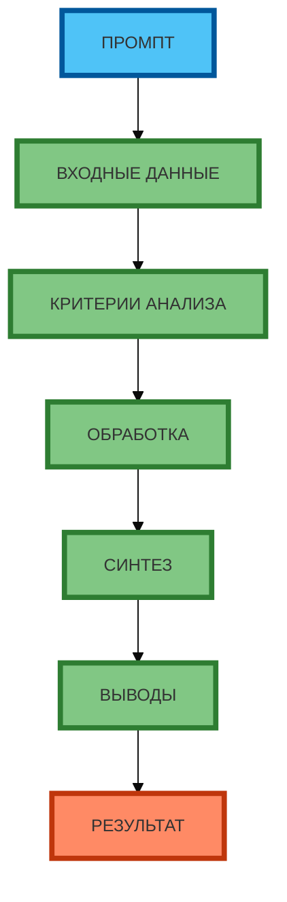

# Схема 1: «Процесс анализа и синтеза» (flowchart, вертикальная компоновка)

**Рисунок 1.** «Процесс анализа и синтеза» (flowchart). **Вертикальная компоновка** (сверху вниз): ПРОМПТ → ВХОДНЫЕ ДАННЫЕ → КРИТЕРИИ АНАЛИЗА → ОБРАБОТКА → СИНТЕЗ → ВЫВОДЫ → РЕЗУЛЬТАТ. Компактная 1:1, текст полный, цвета и рамки 4px. Прямые стрелки.